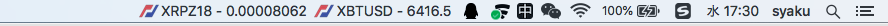
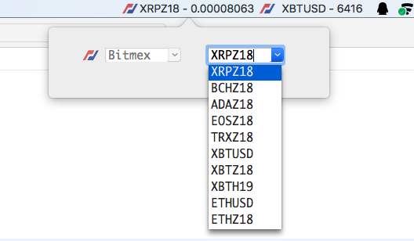

  

# CoinQuotor

## A menu bar widget for macOS that monitors CryptoCurrency

*中文说明的[连接](README_CN.md).*

- Widget

- Select Crypto Currency

## Supported Cryptocurrency Exchange Markets

|  | Exchange Name | countries |
| :--- | :--- | :--- |
|  | BitMEX | Seychelles |
|  | Binance | Japan |

## Download

[v1.0.0](https://github.com/zlq4863947/CoinQuotor/releases/download/v1.0.0/CoinQuotor-v1.0.0.pkg)