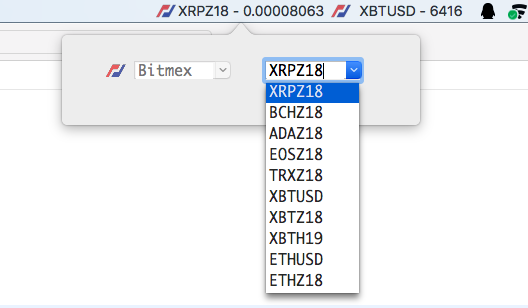

  

# CoinQuotor

## 一个用于监视数字货币的macOS菜单栏小部件

*A English version of this document can be found [here](README.md).*

- 小部件

- 选择交易对

## 当前支持的交易所

|  | 交易所名称 | 国家 |
| :--- | :--- | :--- |
|  | BitMEX | 塞舌尔共和国 |
|  | Binance | 日本 |

## 下载

[v1.0.0](https://github.com/zlq4863947/CoinQuotor/releases/download/v1.0.0/CoinQuotor-v1.0.0.pkg)